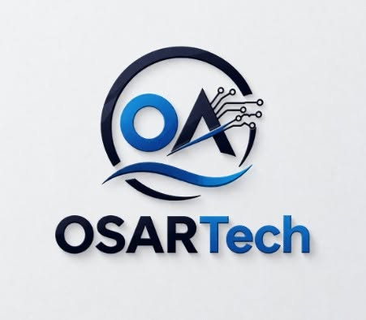

# OSARTech

  

<h1 align="center">OSARTech</h1>

  <strong>Redefining Technology.</strong>

## Redefining Technology

OSARTech is a Nigerian technology company dedicated to building innovative software, AI, robotics, and IoT solutions that solve real-world problems.

We develop reliable, modern, and scalable products for education, businesses, developers, and future technologies.

---

## 🚀 Our Products

### 📚 SchoolOS
An all-in-one school management platform designed to simplify administration, student management, results processing, attendance, fee management, and Computer-Based Testing (CBT).

🌐 https://schoolos.osartech.com.ng

---

## 🔬 Projects

- 📚 SchoolOS
- 🤖 OSARRover *(In Development)*
- 🧠 OSAR AI *(Planned)*
- 💻 OSAR Programming Language *(Research & Development)*
- 🌐 Custom Web Applications

---

## 🌱 Our Mission

To build innovative technologies that empower people, businesses, and educational institutions across Africa and beyond.

---

## 💙 Core Values

- Innovation
- Simplicity
- Reliability
- Security
- Excellence

---

## 🤝 Contributing

We welcome developers, designers, and innovators who are passionate about building impactful technology.

---

## 📫 Connect With Us

🌐 Website: https://osartech.com.ng

📘 Facebook:
https://facebook.com/osartech

📷 Instagram:
https://instagram.com/osartech

---

Made with 💙 by **OSARTech**
